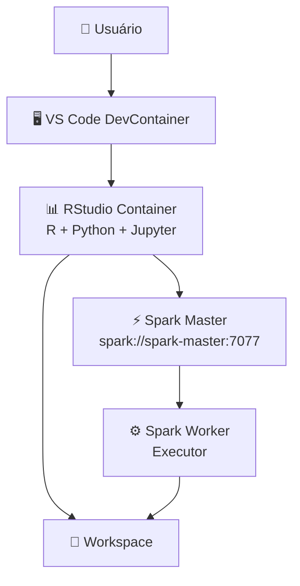
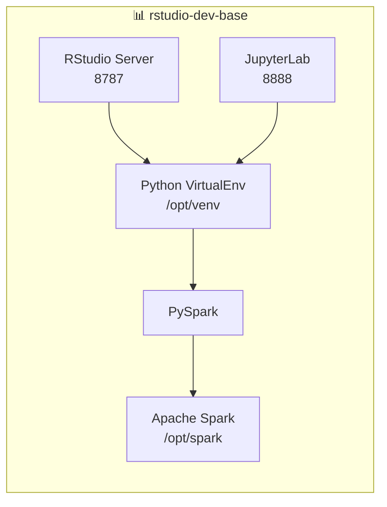
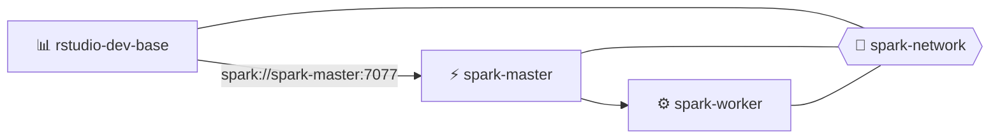
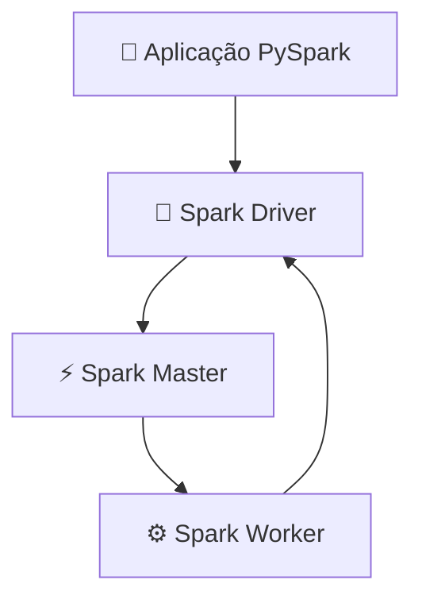
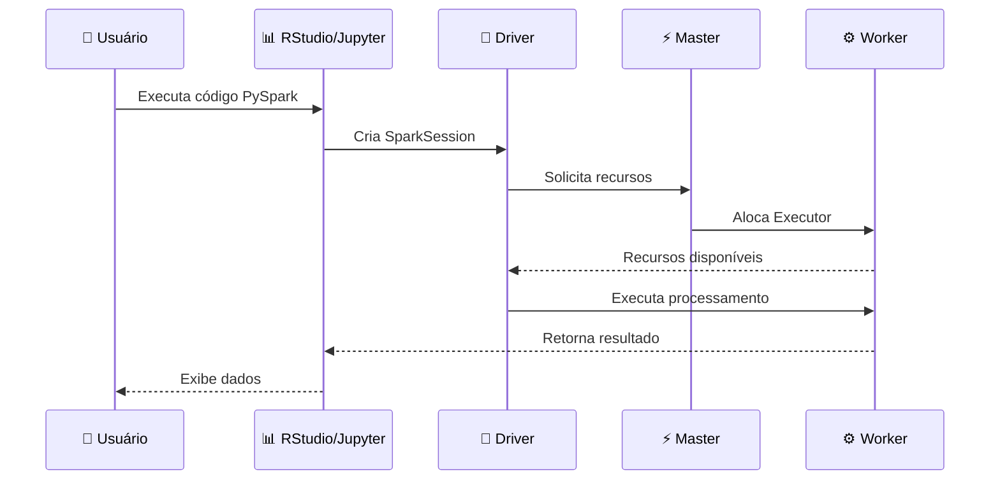
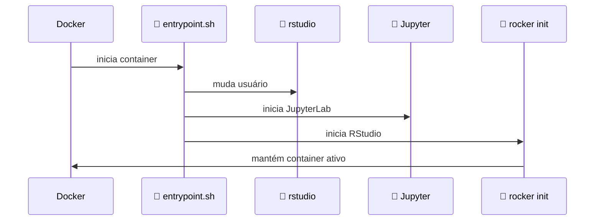
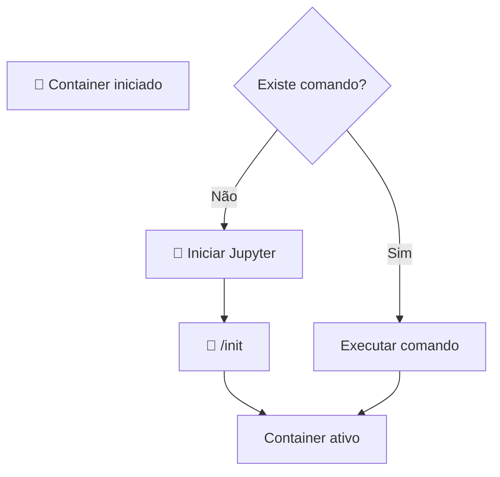
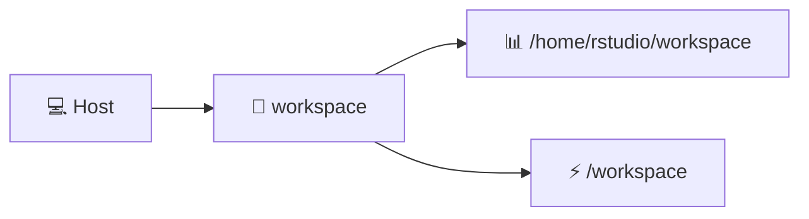
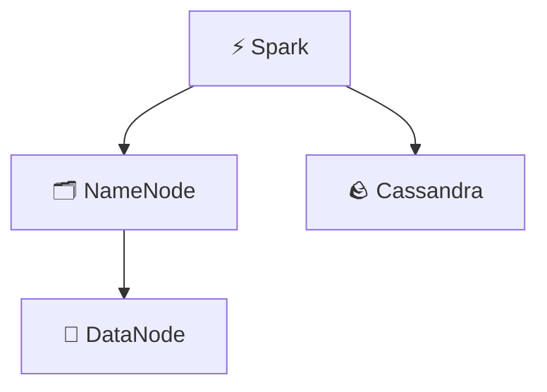

# 🚀 Plataforma Data Science + Apache Spark + RStudio + Jupyter

## 📌 Visão Geral

Ambiente integrado para:
* 🧪 RStudio Server
* 🐍 Python + JupyterLab
* ⚡ Apache Spark Cluster
* 🔥 PySpark
* 📦 Docker Compose
* 🖥️ VS Code DevContainer

---

# 🏗️ Arquitetura Macro


---

# 🧩 Arquitetura Micro - RStudio


---

# ⚡ Arquitetura da Plataforma

> Este diagrama representa a arquitetura de execução dos containers Docker, demonstrando a rede interna `spark-network`, o container de desenvolvimento RStudio atuando com Spark Driver e a comunicação com o cluster Spark Standalone composto pelo Master e Worker.
> 
## 1. Diagrama de Arquitetura Docker Spark + RStudio


## 2. Diagrama de Arquitetura Spark Runtime


---

# 🔄 Sequência de Execução PySpark


---

# 🚀 Inicialização do Container


---

# 🔁 Fluxo do Entrypoint


---

# ☕ Java e Apache Spark
Spark 3.5.x utiliza melhor:
```
Spark 3.5.1
      |
      |
Java 17 LTS
      |
      |
PySpark
      |
      |
Python
```
Configuração:
```yaml
JAVA_HOME=/usr/lib/jvm/java-17-openjdk-amd64
```

## ⚠️ Java 26
Evitar:
```
openjdk-26
```
Motivo:
* incompatibilidade JVM
* bibliotecas Spark podem falhar
* versão fora do ciclo LTS
Recomendado:
```
Java 17
   +
Spark 3.5
   +
Python 3
```

---

# 🌐 Portas
| Porta | Serviço          |
| ----- | ---------------- |
| 8787  | RStudio          |
| 8888  | Jupyter          |
| 7077  | Spark Master RPC |
| 8080  | Spark Master UI  |
| 8081  | Spark Worker UI  |

---

# 🔗 Comunicação Docker
Dentro da rede Docker:
```
rstudio
   |
   |
spark://spark-master:7077
   |
   |
spark-worker
```
Não usar:
```
spark://localhost:7077
```
porque localhost dentro do container aponta para o próprio container.

---

# 📂 Volumes


---

# 🗄️ Futuro: HDFS + Cassandra
Arquitetura:


---

# 📌 Componentes atuais

✅ RStudio Server
✅ JupyterLab
✅ Python Virtual Environment
✅ PySpark
✅ Spark Master
✅ Spark Worker
✅ Docker Compose
✅ VS Code DevContainer

Próximas integrações:
➡️ Hadoop HDFS
➡️ Cassandra Connector
➡️ Kafka
➡️ Delta Lake
➡️ Spark Streaming